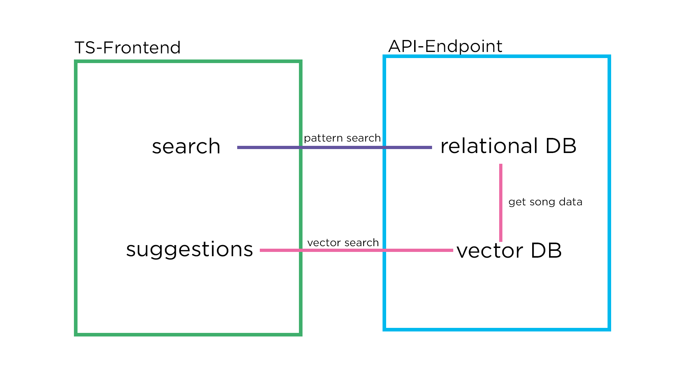

# Shuffle.ai
You can test the project [here]().
If there is no website --> project not finished :) 

## General
The project aims to use a [vector database](https://milvus.io/docs/install_standalone-docker.md) to find fitting songs for a playlist. Using the Vector DB the project understands the direction of the playlist and can suggest really fitting songs. Building up the Playlist with a relational DB.

## Quality analysis
By now only can talk about small tests unittesting etc. comming.
Reuslts at first glance are solid --> 3 out of 6 suggestions okay fit the playlist

## Architecture
Here the first draft of the architecture

## Vector DB
### Setup
The project uses a milvus vectordatabase setup with the [e5-small](https://huggingface.co/intfloat/multilingual-e5-small) embedding model to create the vector representation.

### Ingestion
Data ingestion will be possible with the api...
By now the ingestion takes place with a Notebook in the song_data folder.

## Data
The startingpoint for the songs is a [dataset](https://www.kaggle.com/datasets/joebeachcapital/30000-spotify-songs) from kaggle. The set is cleaned for unnecessary columns and duplicates. With webscraping the data is extended by a lyrics column.

## Comments
- Could combine the two apis to one 
    - querying the milvus is awful